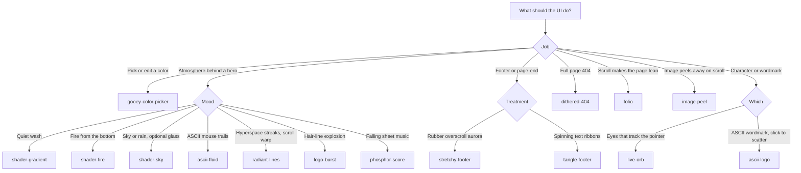

# 23rd

23rd is a shadcn registry of opinionated components. Install with the shadcn CLI, then own the source. Every published item has a React build and a Svelte 5 build. This skill is the playbook. Open the linked files before inventing props.

This folder is checked in twice and the copies must stay identical. `skills/23rd/` is the path the skills CLI and [skills.sh](https://skills.sh) discover. `.cursor/skills/23rd/` is what Cursor loads as `/23rd` in this repo.

| File                             | Read it when                                       |
| -------------------------------- | -------------------------------------------------- |
| [components.md](components.md)   | Picking a component, pitfalls, one working example |
| [apis.md](apis.md)               | Writing props, callbacks, or theme behavior        |
| [recipes.md](recipes.md)         | Assembling a hero, 404, footer, or accent          |
| [conventions.md](conventions.md) | Adding a component to this repo                    |

Do not invent props, CSS variables, or variants. If a prop is not in [apis.md](apis.md), it does not exist.

## Install

The consumer project must already be a shadcn project. React files import `cn` from `@/lib/utils` and land in `components/ui/`. Svelte files inline their own `cn`, use `class` (not `className`), and land in `src/lib/components/ui/`. React components are `"use client"`.

Replace `<name>` with the kebab-case item (`shader-gradient`, `gooey-color-picker`, …).

React:

```bash
pnpm dlx shadcn@latest add @23rd/<name>
npx shadcn@latest add @23rd/<name>
yarn dlx shadcn@latest add @23rd/<name>
bunx --bun shadcn@latest add @23rd/<name>
```

Svelte 5 (item suffix `-svelte`):

```bash
pnpm dlx shadcn@latest add @23rd/<name>-svelte
npx shadcn@latest add @23rd/<name>-svelte
yarn dlx shadcn@latest add @23rd/<name>-svelte
bunx --bun shadcn@latest add @23rd/<name>-svelte
```

GitHub source, if `@23rd` is not configured:

```bash
pnpm dlx shadcn@latest add radiumcoders/23rd.dev/<name>
pnpm dlx shadcn@latest add radiumcoders/23rd.dev/<name>-svelte
```

Imports after install:

```tsx
import { ShaderGradient } from "@/components/ui/shader-gradient"
```

```svelte
<script>
  import ShaderGradient from "$lib/components/ui/shader-gradient.svelte"
</script>
```

npm dependencies the registry declares:

| Item                                                     | React    | Svelte |
| -------------------------------------------------------- | -------- | ------ |
| `gooey-color-picker`, `tangle-footer`, `stretchy-footer` | `motion` | none   |
| every other item                                         | none     | none   |

Published index: `https://23rd.dev/r/registry.json`. Docs: `https://23rd.dev/docs`.

## Choose



Disambiguation that agents get wrong:

| User says                                         | Use                  | Not                                                      |
| ------------------------------------------------- | -------------------- | -------------------------------------------------------- |
| Color picker, swatch, hex, hue, alpha, eyedropper | `gooey-color-picker` | Any shader. Shaders are not controls.                    |
| Soft gradient behind a headline                   | `shader-gradient`    | `gooey-color-picker`, `tangle-footer`                    |
| Fire, embers, heat under a hero                   | `shader-fire`        | `dithered-404` unless the page is a 404                  |
| 404 that burns under the cursor                   | `dithered-404`       | `shader-fire`                                            |
| Footer of nested spinning sentences               | `tangle-footer`      | `stretchy-footer`                                        |
| Overscroll rubber band, aurora at the bottom      | `stretchy-footer`    | `tangle-footer`                                          |
| Page leans while scrolling                        | `folio`              | `stretchy-footer` (that one stretches, it does not tilt) |
| Image or sticker peels / curls off as you scroll  | `image-peel`         | `folio` (the page leans, it does not peel)               |
| Stars that speed up when you scroll               | `radiant-lines`      | `logo-burst`                                             |
| Logo explodes into lines                          | `logo-burst`         | `ascii-logo`                                             |
| ASCII letters that shove, scatter, and fall       | `ascii-logo`         | `ascii-fluid` (trails, not a wordmark)                   |
| CRT notation, phosphor, staves                    | `phosphor-score`     | `shader-sky`                                             |
| A face / orb / mascot                             | `live-orb`           | `logo-burst`                                             |

There is one variant enum in the whole registry: `LiveOrb` `variant` is `"white" | "black" | "webgl" | "custom"`. Nothing else has `variant`.

## Compose

Backgrounds and shaders fill the parent. They do not create a page.

```tsx
<section className="relative isolate min-h-svh overflow-hidden bg-background">
  <ShaderGradient />
  <div className="relative z-10">{/* content */}</div>
</section>
```

Same shell for `ShaderFire`, `ShaderSky`, `AsciiFluid`, `LogoBurst`, `PhosphorScore`, and `Dithered404`. Give the parent a height. Put UI in a later stacking context (`relative z-10`).

`RadiantLines` is transparent and warps with scroll. Inside an overflow div, pass the scroller (`containerRef` in React, `container` in Svelte) and make the canvas `sticky top-0 h-svh`. Omit the scroller to use the window.

`Folio` and `StretchyFooter` are the scroller by default. Put the page in `children`. For a real document, set `windowScroll` and mark the tilting or lifting element (`data-folio-page` or `data-stretchy-page`).

`ImagePeel` is a tall sticky section (`h-[240vh]` unless you override it). Pass `src`. The sheet sticks to the nearest scroll parent and curls off as that scroller moves. `children` is what shows underneath. `side` is the corner that lifts (`top-left`, `top-right`, `bottom-left`, `bottom-right`). `amount` is how much of the image peels away at the end of the scroll (`1` clears it). The back of the sticker is `#FFFFFF`. There is no drop shadow. Transparent pixels stay transparent, so a die-cut sticker peels in its own shape. Inspiration: [React Bits Sticker Peel](https://reactbits.dev/animations/sticker-peel), which peels on hover. Image Peel peels on scroll. A local copy of that reference lives in `tmp-demos/sticker-peel` and is not a registry item.

`TangleFooter` is a `<footer>`. It is not a background. Place it after the page.

`GooeyColorPicker` is an inline control. It opens upward from the trigger. Give it room (`overflow-visible`); do not clip it in `overflow-hidden`.

`LiveOrb` is a fixed square (`size`, default `280`). It does not fill the viewport. The body stays put; only the eyes move.

## Theme

Default `theme` is `"auto"` wherever a component has that prop (`"light" | "dark" | "auto"`). Resolution order:

1. `theme="dark"` or `theme="light"` forces it.
2. `auto`: `html.dark` → dark, `html.light` → light, then `data-theme="dark"|"light"`, then `prefers-color-scheme`.

That matches shadcn / `next-themes` with `attribute="class"`. There is no shared CSS-variable theme API.

Exceptions:

- Passing `colors` to `ShaderGradient`, `ShaderFire`, or `ShaderSky` replaces the stock palette and does not swap with dark mode. Omit `colors` to get the light/dark pair.
- Passing `color` (and `backgroundColor` where it exists) overrides ink. Omit it to follow the theme.
- `TangleFooter` paints `--tangle-ribbon` and `--tangle-text` on itself when `ribbon` / `textColor` are omitted. Pass those props to override. `background` omitted uses `#EFEAE2` / `#121210`.
- `PhosphorScore` canvas is transparent in light mode (`LIGHT_BG`) and `#050505` in dark mode (`DARK_BG`). A dark phosphor field is a hard rectangle. Clip the parent (`overflow-hidden rounded-*`) if the square edge matters. Open issue: the docs preview border looks boxed ([#28](https://github.com/radiumcoders/23rd.dev/issues/28)).
- `Folio` tilt peaks at an internal 16°. It is not a prop. On a Mac trackpad the lean is easy to miss ([#29](https://github.com/radiumcoders/23rd.dev/issues/29)). Do not add a tilt prop that does not exist. `playFolioDemo` only previews the lean; it is not the interaction.
- `ImagePeel` has no `theme` prop and no edge sides (`top`, `right`, `bottom`, `left`). The back of the sticker is `#FFFFFF`. Corners curl on the diagonal. There is no drop shadow.

`prefers-reduced-motion: reduce` is honored by the canvas and motion components (still frame, no tilt, no stretch, no tangle spin). Do not add a `reducedMotion` prop.

## Catalog

Categories match `content/docs/components/meta.json`.

| Name                 | Category   | One line                                                      | Frameworks     |
| -------------------- | ---------- | ------------------------------------------------------------- | -------------- |
| `logo-burst`         | Background | Hair-line tentacles explode from center, then breathe         | React + Svelte |
| `phosphor-score`     | Background | Vertical CRT score; notes fall, bloom, flare                  | React + Svelte |
| `radiant-lines`      | Background | Hyperspace streaks; warp follows scroll                       | React + Svelte |
| `ascii-fluid`        | Background | Pointer trails quantized to an ASCII brightness ramp          | React + Svelte |
| `shader-gradient`    | Shaders    | Quiet WebGL wash behind heroes and empty states               | React + Svelte |
| `shader-fire`        | Shaders    | Sparse fire tongues rising from the bottom                    | React + Svelte |
| `shader-sky`         | Shaders    | Clear sky or rain; optional dotted window glass               | React + Svelte |
| `tangle-footer`      | Footers    | Five nested SVG text ribbons                                  | React + Svelte |
| `stretchy-footer`    | Footers    | Dia-style rubber overscroll with an aurora floor              | React + Svelte |
| `live-orb`           | Characters | Lit sphere; eyes follow the pointer                           | React + Svelte |
| `ascii-logo`         | Characters | ASCII wordmark: hover shove, click scatter / fall / gather    | React + Svelte |
| `dithered-404`       | Pages      | Bayer 404 burned by a fireball cursor, then reforms           | React + Svelte |
| `folio`              | Sections   | Page leans on scroll, then springs flat                       | React + Svelte |
| `image-peel`         | Sections   | Image peels away as you scroll                                | React + Svelte |
| `gooey-color-picker` | Components | Swatch opens into hue, alpha, and hex under an SVG goo filter | React + Svelte |

## Minimal installs that must be right

Quiet hero wash:

```bash
pnpm dlx shadcn@latest add @23rd/shader-gradient
```

```tsx
"use client"

import { ShaderGradient } from "@/components/ui/shader-gradient"

export function Hero() {
  return (
    <section className="relative isolate min-h-svh overflow-hidden bg-background">
      <ShaderGradient />
      <div className="relative z-10 mx-auto flex min-h-svh max-w-xl flex-col items-center justify-center px-6 text-center">
        <h1 className="text-4xl font-medium tracking-tight">Ship the sharper default</h1>
      </div>
    </section>
  )
}
```

Color control (not a background). Uncontrolled unless `value` is passed. Omitted color is `{ h: 320, s: 90, l: 58, a: 1 }`, not the docs-table example `{ h: 210, s: 90, l: 55, a: 1 }`.

```bash
pnpm dlx shadcn@latest add @23rd/gooey-color-picker
```

```tsx
"use client"

import { GooeyColorPicker } from "@/components/ui/gooey-color-picker"

export function Accent() {
  return (
    <GooeyColorPicker
      defaultValue={{ h: 210, s: 90, l: 55, a: 1 }}
      onChange={(color, css) => {
        console.log(color, css)
      }}
    />
  )
}
```

Ribbon footer (not an overscroll effect):

```bash
pnpm dlx shadcn@latest add @23rd/tangle-footer
```

```tsx
"use client"

import { TangleFooter } from "@/components/ui/tangle-footer"

export function SiteFooter() {
  return (
    <TangleFooter
      lines={[
        "Ship something opinionated.",
        "Install what you need and move.",
      ]}
    />
  )
}
```

Svelte equivalents use `class`, default imports, and `@23rd/<name>-svelte`. Full prop tables are in [apis.md](apis.md). More assemblies are in [recipes.md](recipes.md).

## Adding a component

Only when the task is to add one to this repository. Follow [conventions.md](conventions.md). Short version: `registry/<name>/` with vanilla engine plus React and Svelte wrappers and a two-item `registry.json`, a doc at `content/docs/components/<name>.mdx`, a row in `content/docs/components/meta.json`, then `pnpm registry:build` and `pnpm test`.
